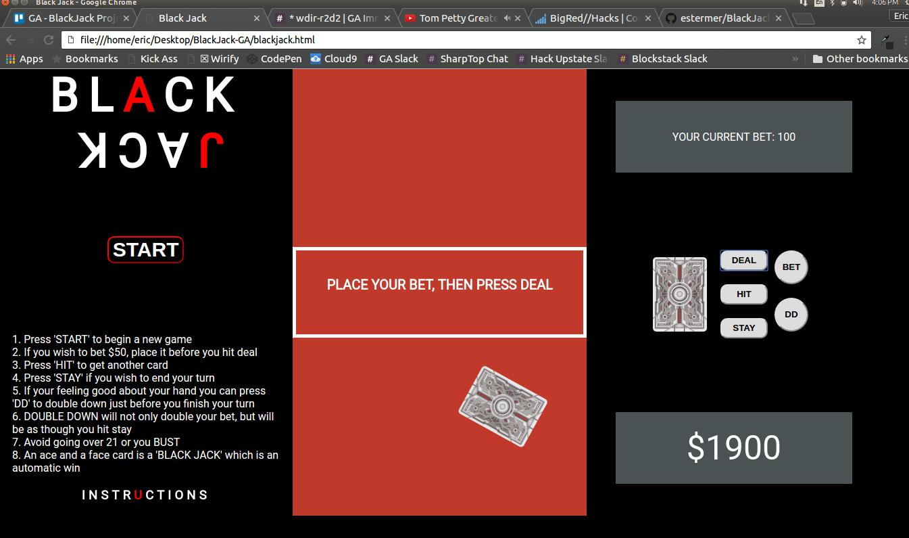

# BlackJack-GA
Unit 1 project for General Assembly
Let's play a game of Black Jack!


### Directory
```
img - folder of all images used in project, and a progress pictures folder
progress - folder containing images of the progress of the project
js - location of blackjack.js
css - location of reset.css and blackjack.css
```

## Process
#### Day 1: 
Took a lot of time putting together a wirefram, setting up to repository, and thinking through the general logic to create some psuedo code. I figured today I would take as much time thinking through the problem before starting since I have not worked on a project this size before. Being clear about the functionality and breaking down the process is fun and I think is going to make the hard coding a lot easier.

Here is a picture of my initial wireframe:


#### Day 2: 
Spent most of today just working on the HTML and CSS, playing around with features and getting it to be close to what I want for layout. Had to change a couple things from the wireframe, and made the page responsive. I really enjoyed flex boxes in class and through it woulld be the best way in laying out my page, yet I struggled a lot with it. I pretty much coded it the long way using padding, margin, and so on, then reverted back to using flex box to compare if what I did worked. Once I figured out the flex box, I was able to clean up my CSS a little.

Then I took some time to create some images and logos for my site such as the face of the cards, the back of the cards, and my logo. If I finish early, my goal is to make it even more stylish.

here is a picture of my first day of CSS and HTML:


#### Day 3:
took a day off to do a coding challenge for employement

#### Day 4:
Was able to crack down on the JavaScript and logiic of the game today. I did most of the interaction with the player, getting all the click events and DOM events that result due to the clicks. There are still a couple of things I need to work out with the display of information and the logic that goes behind it, but for now it works.

I also had an issue with passing variable values by reference when shuffling my deck of cards, but I was easily able to submit an issue to a supervisor and get some help understanding it after trying to find the answer for a while on my own.

Did some touch ups on the CSS as well to make the cards ready for display and make them pop a little.

Here is some pictures of my progress so far:


#### Day 5: 
Worked all day just playing around with timers, setTimeout and setInterval to get the animations for sliding the card across to the playing board. Also go to do a card flip. This was hard but fun, I finally got the hang of it near the end of the day. Had to leave for the day earrly to go to Cornell for BigRedHacks!

here are a few updated pictures:



#### Day 6, 7, & 8

Took the weekend off to go to a Hack-A-Thon at Cornell University for BigRed Hacks where my team worked on a web app combined with mobile QR scanners to authorize mass social media friending.


